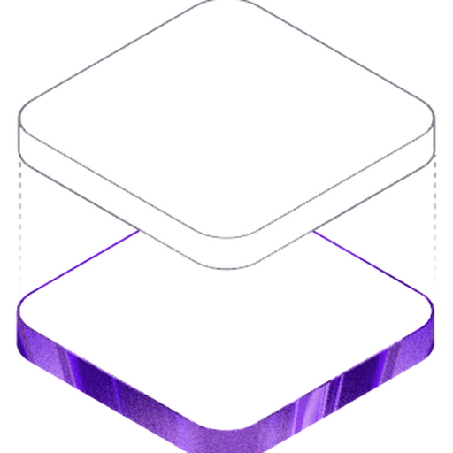

<div align="center">
  

  # Echo — P2P LAN Chat

  **Decentralized instant messaging for your local network. No server. No internet. Just talk.**

  <p>
    <a href="https://www.rust-lang.org/" target="_blank">
      
    </a>
    <a href="https://tauri.app/" target="_blank">
      
    </a>
    <a href="https://react.dev/" target="_blank">
      
    </a>
    <a href="https://tailwindcss.com/" target="_blank">
      
    </a>
    <br/>
    
    <a href="LICENSE">
      
    </a>
    
  </p>

  <h3>
    <a href="#features">Features</a>
    <span> · </span>
    <a href="#demo">Demo</a>
    <span> · </span>
    <a href="#quick-start">Quick Start</a>
    <span> · </span>
    <a href="#how-it-works">How It Works</a>
    <span> · </span>
    <a href="#build">Build</a>
  </h3>
</div>

---

## ✨ Why Echo?

> **Have you ever been in an office, school lab, or LAN party and needed to send a message or file to a colleague — but setting up a server or logging into Slack/WeChat felt like overkill?**

**Echo** is purpose-built for that moment. It discovers peers on your local network through LAN broadcast/multicast discovery, optional cross-subnet scanning, and manual IP lookup; messages and files move directly over TCP. It requires **zero infrastructure** — no servers, no accounts, no internet connection.

✅ **100% offline** — works entirely on your LAN  
✅ **Zero configuration** — launch and instantly see who's online  
✅ **Privacy-first** — your data never touches the cloud  
✅ **Cross-platform** — macOS, Windows, Linux

---

## 🚀 Features

<table>
  <tr>
    <td align="center" width="50%">
      <h3>🔍 LAN Discovery</h3>
      <p>UDP broadcast/multicast discovery finds nearby peers, with optional configured subnet scanning and manual IP lookup.</p>
    </td>
    <td align="center" width="50%">
      <h3>💬 P2P Chat</h3>
      <p>Direct TCP connections for private and group chat, with pending state, retry feedback, forwarding, and local history.</p>
    </td>
  </tr>
  <tr>
    <td align="center">
      <h3>📎 File Sharing</h3>
      <p>Drag & drop, file picker, or paste images. Receive files with "Show in folder" and click-to-open.</p>
    </td>
    <td align="center">
      <h3>🖼️ Image Paste</h3>
      <p>Press <kbd>Ctrl+V</kbd> to paste screenshots and images directly into the chat — no saving needed.</p>
    </td>
  </tr>
  <tr>
    <td align="center">
      <h3>🟢 Online Status</h3>
      <p>Reliable health-check via TCP port probing every 8 seconds. See who's online at a glance.</p>
    </td>
    <td align="center">
      <h3>📜 Chat History</h3>
      <p>Messages are persisted locally in SQLite. Search spans private and group chats, with jump-to-context from results.</p>
    </td>
  </tr>
  <tr>
    <td align="center">
      <h3>🔔 Unread & Recent</h3>
      <p>Unread badges, tray counts, recent contacts, and active group conversations keep busy chats visible.</p>
    </td>
    <td align="center">
      <h3>📝 Profile Management</h3>
      <p>Editable username & department. Smart suggestions from saved data and online peers.</p>
    </td>
  </tr>
</table>

---

## 📸 Demo

<div align="center">
  
  <p><em>Echo in action — sidebar with online contacts, active chat window, and message input.</em></p>
</div>

---

## 🛠️ Tech Stack

| Layer | Technology |
|-------|-----------|
| 🖥️ Desktop Framework | [Tauri 1.8](https://tauri.app/) |
| 🎨 Frontend | [React 19](https://react.dev/) + [TypeScript](https://www.typescriptlang.org/) + [Tailwind CSS 4](https://tailwindcss.com/) + [Vite](https://vitejs.dev/) |
| ⚙️ Backend | [Rust](https://www.rust-lang.org/) (Tokio, SQLite, sqlx) |
| 🔎 Discovery | UDP broadcast/multicast + optional configured subnet scan; mDNS code is present but currently disabled |
| 🔗 Communication | TCP Direct (JSON-line protocol) |
| 🗄️ Storage | SQLite (local database) |

---

## ⚡ Quick Start

### Prerequisites

- [Rust](https://www.rust-lang.org/tools/install) >= 1.88
- [Node.js](https://nodejs.org/) >= 18
- npm >= 9

### Install & Run

```bash
# 1. Clone the repository
git clone https://github.com/tf1997/echo.git
cd echo

# 2. Install frontend dependencies and build web assets
cd frontend && npm install
npm run build

# 3. Run the Tauri shell
cd ../src-tauri && cargo run
```

On first launch you'll be prompted to set a username and department — this is stored locally in SQLite and never leaves your machine.

### 🧪 Multi-instance Testing (Same Machine)

Want to see how Echo works on a single machine? Run two instances with different ports:

macOS / Linux:

```bash
cd src-tauri

# Terminal A — Instance 1
ECHO_PORT=9527 ECHO_DATA_DIR=/tmp/echo-a cargo run

# Terminal B — Instance 2
ECHO_PORT=9528 ECHO_DATA_DIR=/tmp/echo-b cargo run
```

Windows PowerShell:

```powershell
cd .\src-tauri

# Terminal A - Instance 1
$env:ECHO_PORT = "9527"
$env:ECHO_DATA_DIR = "D:\tmp\echo-a"
cargo run

# Terminal B - Instance 2
$env:ECHO_PORT = "9528"
$env:ECHO_DATA_DIR = "D:\tmp\echo-b"
cargo run
```

Windows cmd.exe:

```cmd
cd /d D:\code\echo\src-tauri

:: Terminal A - Instance 1
set ECHO_PORT=9527
set ECHO_DATA_DIR=D:\tmp\echo-a
cargo run

:: Terminal B - Instance 2
set ECHO_PORT=9528
set ECHO_DATA_DIR=D:\tmp\echo-b
cargo run
```

They should discover each other through the local discovery channel. You can also use the manual IP lookup in the sidebar when broadcast traffic is filtered.

---

## 🔧 How It Works

```
┌─────────────┐     LAN Discovery      ┌─────────────┐
│   Echo A    │◄──────────────────────►│   Echo B    │
│  (9527)     │                        │  (9528)     │
│             │◄── TCP Direct Chat ───►│             │
│  ┌───────┐  │                        │  ┌───────┐  │
│  │SQLite │  │                        │  │SQLite │  │
│  │ Local │  │                        │  │ Local │  │
│  └───────┘  │                        │  └───────┘  │
└─────────────┘                        └─────────────┘
```

1. **🚀 Startup** — Loads user profile from local SQLite; enters first-time setup if none exists
2. **🔎 Discovery** — Starts UDP broadcast/multicast discovery; optional configured /24 scans help with cross-subnet reachability
3. **💾 Contact Storage** — Discovered peers are automatically saved to the local `peers` table (ip, port, online status, last seen time)
4. **❤️ Health Check** — Parallel TCP port probing every 8 seconds, with a short grace window for smoother online/offline transitions
5. **💬 Chat** — TCP direct connection for JSON-line messages, files, stickers, and group notifications
6. **📋 History** — Private and group records are fully local; no central service dependency

---

## 🗄️ Database Schema

Core tables are stored in `ECHO_DATA_DIR/echo.db` or the system app data directory:

| Table | Purpose |
|-------|---------|
| `user_profile` | Local user info (peer_id, username, department) |
| `peers` | Contact history (peer_id, username, department, ip, port, is_online, first_seen_at, last_seen_at) |
| `messages` | Private and group chat records (sender_id, receiver_id, group_id, content, msg_type, file_path, file metadata, timestamp, is_read) |
| `groups` / `group_members` | Group metadata and membership |
| `recent_contacts` | Contact ordering for the recent view |
| `pending_notifications` / `pending_file_transfers` | Retry queues for offline delivery paths |

---

## 🌍 Environment Variables

| Variable | Description | Default |
|----------|-------------|---------|
| `ECHO_PORT` | TCP listen port for chat | `9527` |
| `ECHO_DATA_DIR` | Data directory (SQLite database location) | System app data directory |

---

## 🏗️ Build

```bash
# Build frontend assets
cd frontend && npm run build

# Build the desktop app (release mode)
cd ../src-tauri && cargo build --release
```

The compiled binary will be available at `src-tauri/target/release/echo`.

---

## 📁 Project Structure

```
echo/
├── frontend/                # React frontend (TypeScript + Tailwind CSS)
│   └── src/
│       ├── App.tsx          # Main page: setup, contacts, chat
│       ├── api.ts           # Tauri invoke wrappers
│       ├── types.ts         # TypeScript type definitions
│       └── components/
│           ├── Sidebar.tsx      # Sidebar: profile, contacts, search
│           ├── ChatWindow.tsx   # Chat: messages, input, drag-drop, paste
│           └── MessageBubble.tsx # Messages: text, file, image preview
├── src-tauri/               # Rust backend (Tauri 1)
│   └── src/
│       ├── main.rs          # Entry point
│       ├── lib.rs           # Tauri bootstrap, state init, tray, update hooks, health-check loop
│       ├── commands.rs      # Tauri commands (IPC interface)
│       ├── state.rs         # Global state (RuntimeServices, AppState)
│       ├── chat/mod.rs      # TCP chat server
│       ├── db/mod.rs        # SQLite database (profile, peers, messages, groups, retry queues)
│       └── discovery/
│           ├── peer.rs      # Peer model
│           ├── service.rs   # Discovery service wrapper
│           └── broadcast.rs # UDP broadcast/multicast and optional subnet scan
└── target/                  # Rust build artifacts
```

---

## 🤝 Contributing

Contributions are welcome! Whether it's bug reports, feature suggestions, or pull requests — feel free to jump in.

1. Fork the repository
2. Create your feature branch (`git checkout -b feature/amazing-feature`)
3. Commit your changes (`git commit -m 'Add amazing feature'`)
4. Push to the branch (`git push origin feature/amazing-feature`)
5. Open a Pull Request

---

## 📄 License

This project is licensed under the [Apache License 2.0](LICENSE).

---

<div align="center">
  <p>Made with ❤️ for local-first, offline-first communication</p>
  <p>
    <a href="https://github.com/tf1997/echo/issues">Report Bug</a>
    ·
    <a href="https://github.com/tf1997/echo/issues">Request Feature</a>
  </p>
</div>
